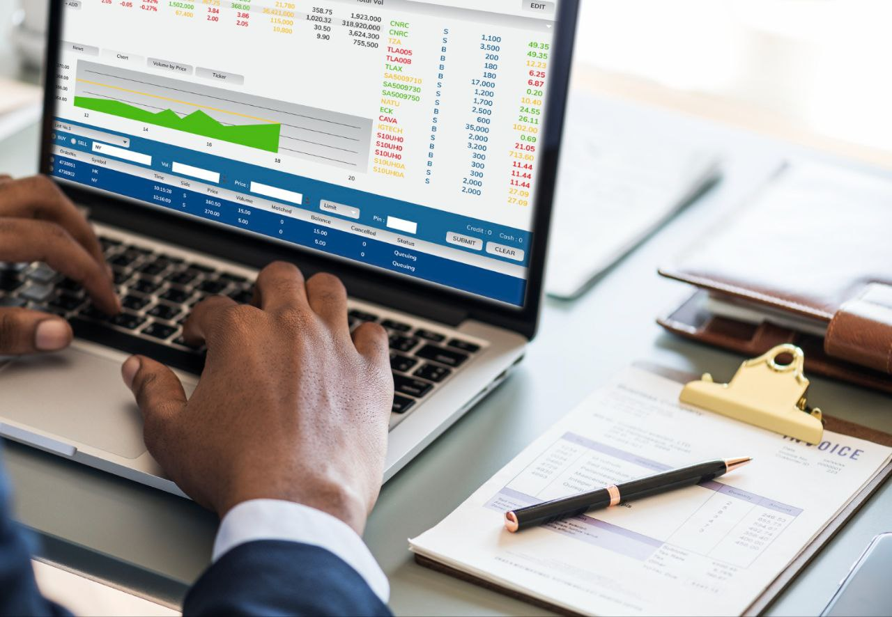
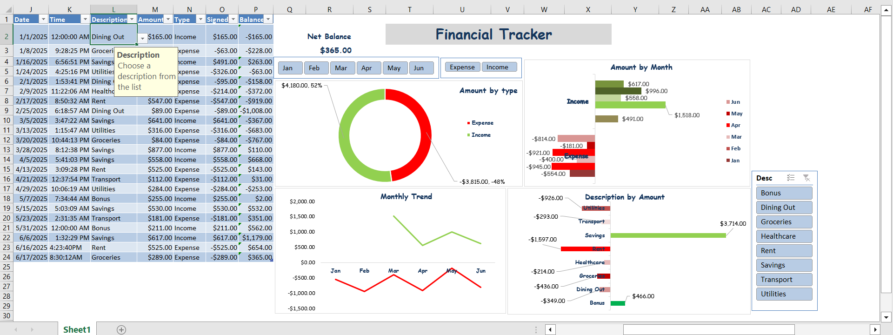
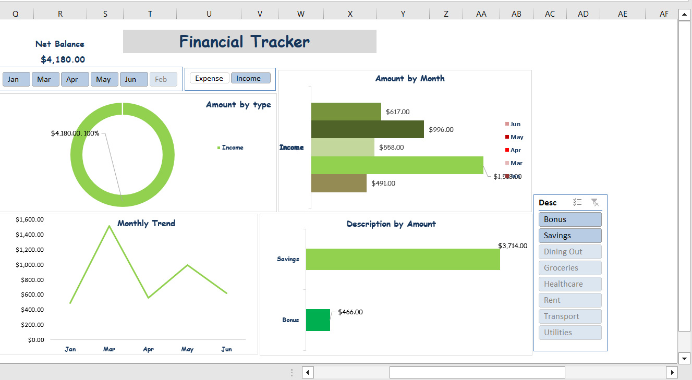
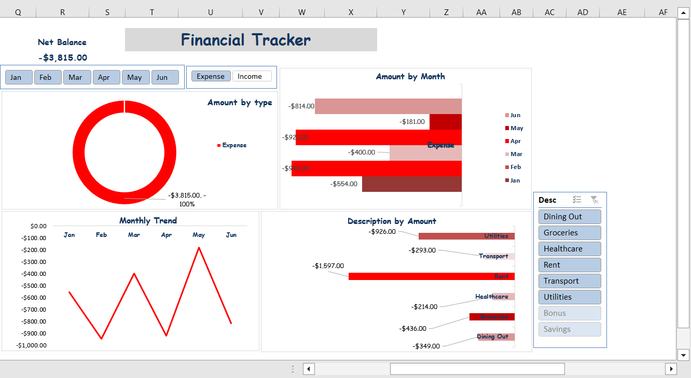

# Excel-Financial-Tracker

## 📌 Project Overview
This project is a personal finance tracker built in Excel.  
It helps record daily transactions (income & expenses), calculate balances, and visualize financial performance using an interactive dashboard.

---

## 🛠 Features
**- Transaction Table**
  - Columns: Date, Time, Description, Type (Income/Expense), Amount, Signed, Balance
  - Applied Data validation with list of Descriptions and also an input message to ensure clean enteries.(e.g choose descriptions from the drop-down), did the same for Type(Income or Expenses) and Amount (input Degits only). 
**- Running Balance**
  - Automatically updates to + or - value once expenses or income is selected from the type drop-down, signed amounts (Income = +, Expense = -) using ``=IF(N2="Income",M2, -M2)``
  - Automatically updates the Balance using ``=P2+O3`` (P=Balance, O=Signed).
**- PivotTables & Charts**
  - Income vs Expense by month
  - Income/Expenses breakdown by Description
  - Monthly trend of balances
**- Dashboard**
  - KPIs: Net Balance, Total Income, Total Expenses
  - Donut chart (Income vs Expense)
  - Line chart (Monthly trend)
  - Bar chart (Category breakdown)
  - Interactive slicers for filtering by Type, Month and Description

---

## 📊 Dashboard Preview

Overview

Monthly Analysis

Income overview

Expenses Overview

---

## 📚 Skills Applied
- Excel formulas (IF, SUMIF running total logic)
- Data validation
- PivotTables & PivotCharts
- Dashboard design & layout
- Interactive slicers for analysis

---

## Why this comes in handy

- It helps individuals track where their money goes each month, thereby Providing a clear view of spending habits, making it easier to identify savings opportunities.

- Acts as a budgeting tool, keeping finances in check and preventing overspending.
Encourages data-driven decision making in personal finance, the same way businesses use dashboards.

- All done in Excel, a tool most people already have.

---

## 📂 Files
- Financial_Tracker.xlsx → Excel file with transaction log & dashboard
