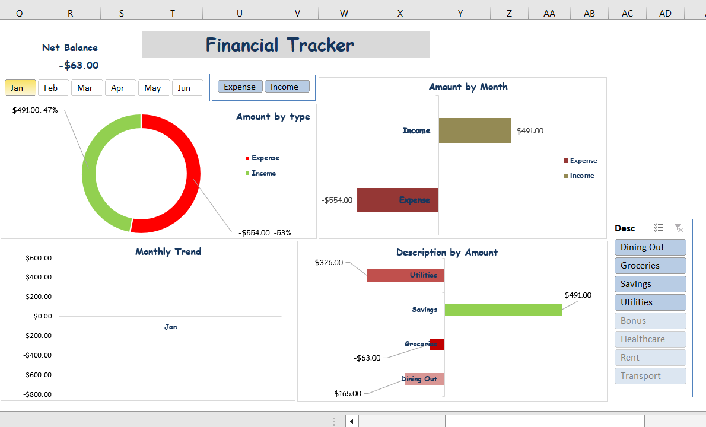

# Excel-Financial / Project-Tracker

## 📌 Project Overview
This project is a personal finance tracker built in Excel.  
It helps record daily transactions (income & expenses), calculate balances, and visualize financial performance using an interactive dashboard.

---

## 🛠 Features
1:**Transaction Table**
  - Columns: Date, Time, Description, Type (Income/Expense), Amount, Signed, Balance
  - Applied Data validation with list of Descriptions and also an input message to ensure a clean entry. (e.g choose descriptions from the drop-down), did the same for Type(Income or Expenses) and Amount (input Degits only). 
2:**Running Balance**
  - Automatically updates to + or - value once expenses or income is selected from the type drop-down, signed amounts (Income = +, Expense = -) using ``=IF(N2="Income",M2, -M2)``
  - Automatically updates the Balance using ``=P2+O3`` (P=Balance, O=Signed).
3:**PivotTables & Charts**
  - Income vs Expense by month
  - Income/Expenses breakdown by Description
  - Monthly trend of balances
**- Dashboard**
  - KPIs: Net Balance, Total Income, Total Expenses
  - Donut chart (Income vs Expense)
  - Line chart (Monthly trend)
  - Bar chart (Category breakdown)
  - Interactive slicers for filtering by Type, Month and Description

---

## 📊 Dashboard Preview

Overview

Monthly Analysis( Highlighting descriptions both Expenses and income within a specific month.

Income overview( Highlighting descriptions of the Savings and month.

Expenses Overview( Highlighting descriptions of the spending and month. 

---

## 📚 Skills Applied
- Excel formulas (IF, SUMIF running total logic)
- Data validation
- PivotTables & PivotCharts
- Dashboard design & layout
- Interactive slicers for analysis

---

## Why this comes in handy

- It helps individuals track where their money goes each month, thereby Providing a clear view of spending habits, making it easier to identify savings opportunities.

- Acts as a budgeting tool, keeping finances in check and preventing overspending.
Encourages data-driven decision making in personal finance, the same way businesses use dashboards.

- All done in Excel, a tool most people already have.

---

## 📂 Files
- Financial_Tracker.xlsx → Excel file with transaction log & dashboard

---

### 📊 Excel Project Tracker

This Excel Project Tracker is a milestone based system for monitoring project tasks. It combines binary values, formulas, and visual indicators to provide a clear view of task progress across different stages.

---

## 🔹 Structure

- Task ID & Task Name: Unique identifier and description of each task.  
- Milestone Columns (Drafted → Approved):  
  - Uses binary indicators → 1 = Completed, 0 = Not Completed.  
  - Conditional formatting replaces the numbers with:
    - ✅ (checkmark) for 1  
    - ❌ (cross mark) for 0  
- To Do %: Shows the proportion of unfinished stages.  
- Completed %: Shows the proportion of finished stages.  

---

## 🔹 Formula Logic

The Completed % is calculated by counting how many stages are marked with 1:

``=COUNTIF(C9:G9,1)/5``
`C9:G9 → The range of the five milestone columns for each task.

`COUNTIF(...,1) → Counts how many milestones are completed.

/5 → Divides by the total number of milestones (5) to return a percentage.

**Examples**:

If a task has 3 milestones completed → 3/5 = 60% and If all milestones are completed → 5/5 = 100%.

The To Do % is the inverse of Completed:

``=1 - (COUNTIF(C9:G9,1)/5)``

---

🔹 Visualization

Icon Sets:

✅ Checkmark for completed stages (1) and ❌ Cross for pending stages (0).

Data Bars:

Green bars for Completed % and Red bars for To Do %.

Overview

---

🔹 Insights

- Provides a milestone-based breakdown of progress per task, combines numeric (percentages) with visual clarity (icons + data bars).

- Enables project managers to quickly identify:

Tasks at risk of delay.

Bottlenecks in workflow.

Overall project progress.
